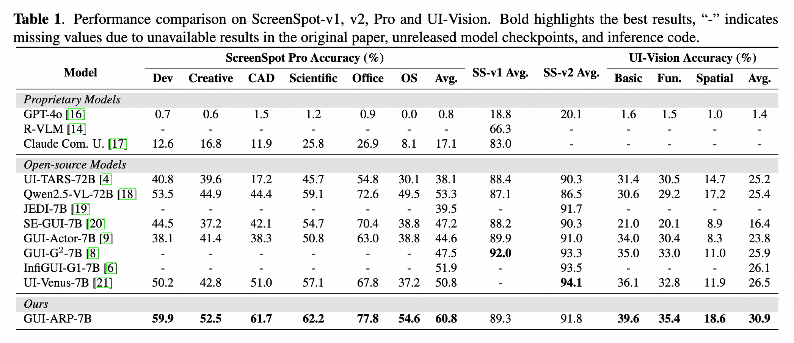

# GUI-ARP

[](https://arxiv.org/abs/2509.15532)

Official implementation of the paper "GUI-ARP: ENHANCING GROUNDING WITH ADAPTIVE REGION PERCEPTION FOR GUI AGENTS"



## Citation

If you find GUI-ARP useful in your research, please consider citing our paper:

```bibtex
@misc{ye2025guiarpenhancinggroundingadaptive,
      title={GUI-ARP: Enhancing Grounding with Adaptive Region Perception for GUI Agents}, 
      author={Xianhang Ye and Yiqing Li and Wei Dai and Miancan Liu and Ziyuan Chen and Zhangye Han and Hongbo Min and Jinkui Ren and Xiantao Zhang and Wen Yang and Zhi Jin},
      year={2025},
      eprint={2509.15532},
      archivePrefix={arXiv},
      primaryClass={cs.CV},
      url={https://arxiv.org/abs/2509.15532}, 
}
```
